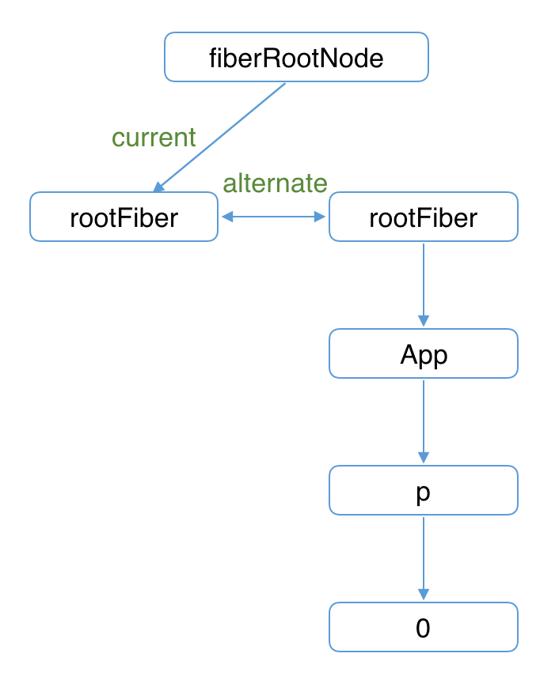
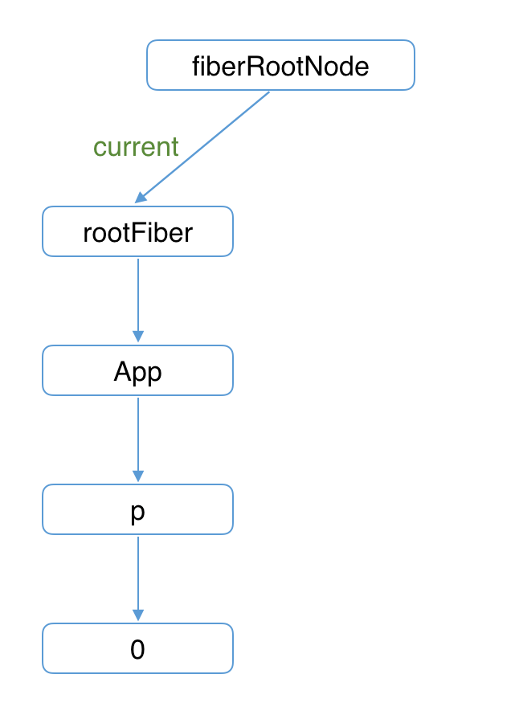
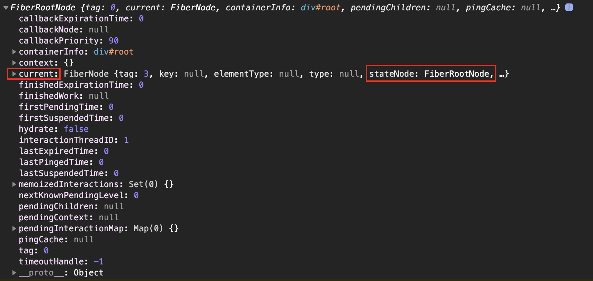

# 三、Fiber 数据结构

## （一）Fiber

Fiber，实际上就是 JavaScript 对象，它是由 VirtualDOM 演变而来的。

在 Fiber 中有很多属性，下面代码块中列举了一些比较重要的属性。这些属性虽然多，但是可以大体分为 4 类：

1. 和 DOM 实例相关的；
2. 和构建 Fiber 树相关的；
3. 和组件状态相关的；
4. 和副作用相关的。

```js
type Fiber = {
  /************************  DOM 实例相关  *****************************/

  // 标记不同的组件类型, 值详见 WorkTag
  tag: WorkTag, // 值为 0-22 之间的数值：0-函数组件，1-类组件，3-当前组件挂载点对应的 Fiber 对象，默认就是 id 为 root 的 div 元素对应的 Fiber 对象，5—普通的 React 节点（div、span等），……

  // 组件类型， div、span、组件构造函数
  type: any,

  // 实例对象： 如类组件的实例；原生 dom 实例；而 function 组件没有实例, 因此该属性是空（null）。
  stateNode: any,

  /************************  构建 Fiber 树相关  ***************************/

  // 指向自己的父级 Fiber 对象
  return: Fiber | null,

  // 指向自己的第一个子级 Fiber 对象
  child: Fiber | null,

  // 指向自己的下一个兄弟 Fiber 对象
  sibling: Fiber | null,

  // 在 Fiber 树更新的过程中，每个 Fiber 都会有一个跟其对应的 Fiber
  // 我们称他为 current <==> workInProgress
  // 在渲染完成之后他们会交换位置
  // alternate 指向当前 Fiber 在 workInProgress 树中的对应 Fiber
  // 双缓存部分会讲到
  alternate: Fiber | null,

  /************************  状态数据相关  ********************************/

  // 即将更新的 props
  pendingProps: any,
  // 旧的 props
  memoizedProps: any,
  // 旧的 state
  memoizedState: any,

  /************************  副作用相关 ******************************/

  // 该 Fiber 对应的组件产生的状态更新会存放在这个队列里面（状态更新并不会立即执行，而是会将多个状态保存到更新队列中，等待实际进行批量更新）
  updateQueue: UpdateQueue<any> | null,

  // 用来记录当前 Fiber 要执行的 DOM 操作，详细参考 SideEffectTag 部分
  effectTag: SideEffectTag,

  // 存储第一个要执行副作用的子级 Fiber 对象
  firstEffect: Fiber | null,

  // 存储下一个要执行副作用的子级 Fiber 对象
  // 执行 DOM 渲染时要先通过 first 找到第一个, 然后通过 next 一直向后查找
  nextEffect: Fiber | null,

  // 存储 DOM 操作完后的副作用 比如调用生命周期函数或者钩子函数的调用
  lastEffect: Fiber | null,

  // 任务的过期时间（超过过期时间任务仍未执行，React 会强制执行任务）
  expirationTime: ExpirationTime, // 同步任务的过期时间的数值会较大

  // 当前组件及子组件处于何种渲染模式 详见 TypeOfMode
  mode: TypeOfMode,
};
```

## （二） WorkTag

`文件位置：packages/shared/ReactWorkTags.js`

```js
type WorkTag =
  | 0
  | 1
  | 2
  | 3
  | 4
  | 5
  | 6
  | 7
  | 8
  | 9
  | 10
  | 11
  | 12
  | 13
  | 14
  | 15
  | 16
  | 17
  | 18
  | 19
  | 20
  | 21
  | 22;

export const FunctionComponent = 0;
export const ClassComponent = 1;
export const IndeterminateComponent = 2;
export const HostRoot = 3;
export const HostPortal = 4;
export const HostComponent = 5;
export const HostText = 6;
export const Fragment = 7;
export const Mode = 8;
export const ContextConsumer = 9;
export const ContextProvider = 10;
export const ForwardRef = 11;
export const Profiler = 12;
export const SuspenseComponent = 13;
export const MemoComponent = 14;
export const SimpleMemoComponent = 15;
export const LazyComponent = 16;
export const IncompleteClassComponent = 17;
export const DehydratedFragment = 18;
export const SuspenseListComponent = 19;
export const FundamentalComponent = 20;
export const ScopeComponent = 21;
export const Block = 22;
```

## （三） TypeOfMode

`文件位置: packages/react-reconciler/src/ReactTypeOfMode.js`

```js
export type TypeOfMode = number;

// 0 同步渲染模式
export const NoMode = 0b0000;
// 1 严格模式
export const StrictMode = 0b0001;
// 10 异步渲染过渡模式
export const BlockingMode = 0b0010;
// 100 异步渲染模式
export const ConcurrentMode = 0b0100;
// 1000 性能测试模式
export const ProfileMode = 0b1000;
```

## （四） SideEffectTag

`文件位置：packages/shared/ReactSideEffectTags.js`

```js
export type SideEffectTag = number;

// Don't change these two values. They're used by React Dev Tools.
export const NoEffect = /*              */ 0b0000000000000; // 0
export const PerformedWork = /*         */ 0b0000000000001; // 1

// You can change the rest (and add more).
export const Placement = /*             */ 0b0000000000010; // 2
export const Update = /*                */ 0b0000000000100; // 4
export const PlacementAndUpdate = /*    */ 0b0000000000110; // 6
export const Deletion = /*              */ 0b0000000001000; // 8
export const ContentReset = /*          */ 0b0000000010000; // 16
export const Callback = /*              */ 0b0000000100000; // 32
export const DidCapture = /*            */ 0b0000001000000; // 64
export const Ref = /*                   */ 0b0000010000000; // 128
export const Snapshot = /*              */ 0b0000100000000; // 256
export const Passive = /*               */ 0b0001000000000; // 512
export const Hydrating = /*             */ 0b0010000000000; // 1024
export const HydratingAndUpdate = /*    */ 0b0010000000100; // 1028

// Passive & Update & Callback & Ref & Snapshot
export const LifecycleEffectMask = /*   */ 0b0001110100100; // 932

// Union of all host effects
export const HostEffectMask = /*        */ 0b0011111111111; // 2047

export const Incomplete = /*            */ 0b0100000000000; // 2048
export const ShouldCapture = /*         */ 0b1000000000000; // 4096
```

## （五） Update

```js
let update: Update<*> = {
  expirationTime,
  suspenseConfig,

  tag: UpdateState,
  payload: null,
  callback: null,

  next: (null: any),
};
```

## （六） UpdateQueue

```js
const queue: <State> = {
  // 上一次更新之后的 state, 作为下一次更新的基础
  baseState: fiber.memoizedState,
  baseQueue: null,
  shared: {
    pending: null,
  },
  effects: null,
}
fiber.updateQueue = queue;
```

## （七） RootTag

`文件位置：packages/shared/ReactRootTags.js`

```js
export type RootTag = 0 | 1 | 2;

// ReactDOM.render
export const LegacyRoot = 0;
// ReactDOM.createBlockingRoot
export const BlockingRoot = 1;
// ReactDOM.createRoot
export const ConcurrentRoot = 2;
```

## （八）双缓存技术

在 React 中，DOM 的更新采用了双缓存技术，双缓存技术致力于更快速的 DOM 更新。

什么是双缓存？举个例子，使用 canvas 绘制动画时，在绘制每一帧前都会清除上一帧的画面，清除上一帧需要花费时间，如果当前帧画面计算量又比较大，又需要花费比较长的时间，这就导致上一帧清除到下一帧显示中间会有较长的间隙，就会出现白屏。

为了解决这个问题，我们可以在内存中绘制当前帧动画，绘制完毕后直接用当前帧替换上一帧画面，这样的话在帧画面替换的过程中就会节约非常多的时间，就不会出现白屏问题。这种在内存中构建并直接替换的技术叫做双缓存。

React 使用双缓存技术完成 Fiber 树的构建与替换，实现 DOM 对象的快速更新。

在 React 中最多会同时存在两棵 Fiber 树，当前在屏幕中显示的内容对应的 Fiber 树叫做 current Fiber 树，当发生更新时，React 会在内存中重新构建一颗新的 Fiber 树，这颗正在构建的 Fiber 树叫做 workInProgress Fiber 树。在双缓存技术中，workInProgress Fiber 树就是即将要显示在页面中的 Fiber 树，当这颗 Fiber 树构建完成后，React 会使用它直接替换 current Fiber 树达到快速更新 DOM 的目的，因为 workInProgress Fiber 树是在内存中构建的所以构建它的速度是非常快的。

一旦 workInProgress Fiber 树在屏幕上呈现，它就会变成 current Fiber 树。

在 current Fiber 节点对象中有一个 alternate 属性指向对应的 workInProgress Fiber 节点对象，在 workInProgress Fiber 节点中有一个 alternate 属性也指向对应的 current Fiber 节点对象。





## （九）区分 fiberRoot 与 rootFiber

fiberRoot 表示 Fiber 数据结构对象，是 Fiber 数据结构中的最外层对象

rootFiber 表示组件挂载点对应的 Fiber 对象，比如 React 应用中默认的组件挂载点就是 id 为 root 的 div

fiberRoot 包含 rootFiber，在 fiberRoot 对象中有一个 current 属性，存储 rootFiber

rootFiber 指向 fiberRoot，在 rootFiber 对象中有一个 stateNode 属性，指向 fiberRoot

在 React 应用中 FiberRoot 只有一个，而 rootFiber 可以有多个，因为 render 方法是可以调用多次的

fiberRoot 会记录应用的更新信息，比如协调器在完成工作后，会将工作成果存储在 fiberRoot 中。


